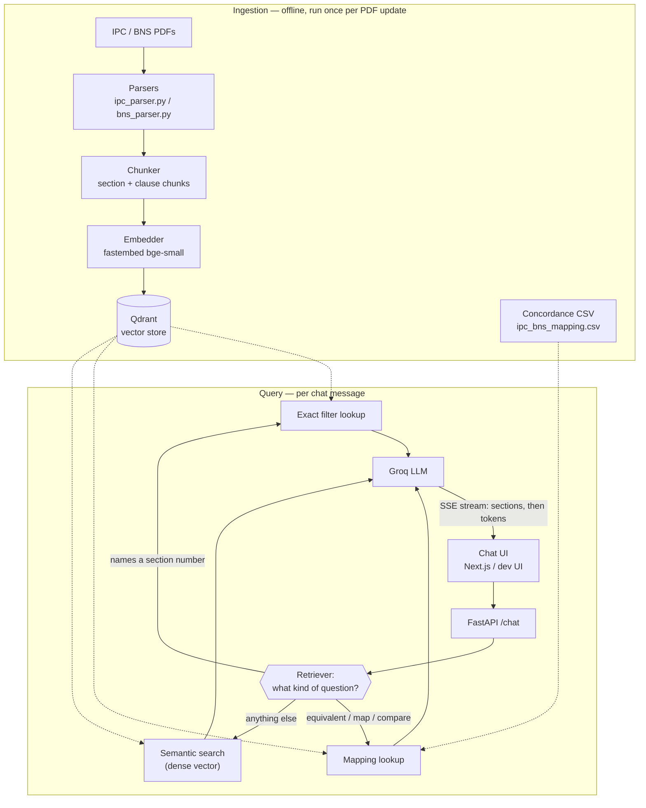

# lexrag

A RAG assistant over the Indian Penal Code (IPC, pre-2024) and the Bharatiya
Nyaya Sanhita (BNS, its 2024 replacement) — chat with the actual section
text, and ask it to map an IPC section to its BNS counterpart (or vice
versa) with a side-by-side comparison.

Informational research tool only. Not legal advice.

## Architecture

Two independent pipelines: an offline **ingestion** pipeline that runs once
per PDF update, and an online **query** pipeline that runs on every chat
message.



**Ingestion flow** (`uv run python -m lexrag.ingestion.ingest`):

1. **Parse** — `ipc_parser.py` / `bns_parser.py` turn each PDF into a list of
   `Section` objects (act, chapter, section number, title, full text). Each
   parser is tuned to that PDF's actual layout (see "How it's built" below).
2. **Chunk** — `chunker.py` turns each `Section` into one `section`-type
   chunk (the full text) and, for long sections, additional `clause`-type
   child chunks (one per Illustration/Exception/Explanation) that point
   back at their parent via `parent_id`.
3. **Embed** — every chunk's text is embedded with `fastembed`
   (`BAAI/bge-small-en-v1.5`, CPU-only).
4. **Upsert** — chunks + embeddings + metadata (act, section number,
   chapter, chunk type, parent id) land in Qdrant, one collection.
5. Separately, `data/mapping/ipc_bns_mapping.csv` — the IPC↔BNS concordance
   — is curated/bootstrapped independently of the vector store (see below);
   it's plain exact-match data, not embedded.

**Query flow** (`POST /chat`):

1. The chat UI (Next.js or the zero-build dev page) POSTs `{query}` to
   FastAPI, which opens an SSE stream.
2. `Retriever.retrieve()` classifies the query by regex into exactly one of
   three modes — this routing is the important design choice, see below.
3. Whichever mode ran, the resulting section(s) are sent immediately as a
   `sections` SSE event, so the UI can show citations before any answer
   text arrives.
4. The retrieved section text is assembled into a prompt and sent to Groq,
   which streams the answer back token-by-token as `token` SSE events.
5. A final `done` event closes the stream (or an `error` event, if the LLM
   call fails — e.g. no API key — without the section citations being lost).

**The three retrieval modes** (why a router instead of pure semantic search):

- **Exact** — the query names a section number ("Section 302", "IPC 420").
  Resolved with a Qdrant *payload filter*, not a vector search — embeddings
  are bad at exact numeric identifiers, and a wrong section number is
  exactly the kind of confident-sounding mistake an ungrounded LLM makes.
- **Mapping** — the query asks for an equivalent/comparison ("what's the
  BNS version of IPC 302?"). Resolved via the curated concordance CSV, then
  both sides' full section text are fetched and handed to the LLM together,
  along with a note if the mapping is only a `suggested` (unverified) match.
- **Semantic** — anything else. Dense vector search over section-level
  chunks; a hit on a `clause`-type chunk is resolved back up to its full
  parent section before reaching the LLM ("small-to-big" retrieval), so the
  model never sees a stray sentence stripped of its surrounding context.

**Example** — "What is the BNS equivalent of IPC Section 302?" is detected
as a mapping-mode query bound to `IPC 302` (not `BNS`, even though "BNS" also
appears in the sentence — the router binds the act to the number it's
adjacent to). The concordance CSV resolves `IPC 302 → BNS 103` (a `verified`
row, cross-checked against both PDFs directly). Both sections' full text are
fetched from Qdrant by exact filter and sent to Groq with instructions to
compare definition, punishment, and any added/removed clauses — the model
never has to guess the section number itself.

## How it's built

- **Parsing** (`src/lexrag/parsing/`) — `IPC-Codes.pdf` and `BNS-Codes.pdf`
  have genuinely different layouts (IPC is a plain single-column bare act
  with amendment footnotes; BNS is an actual two-column Gazette of India
  notification with side-margin headnotes and repeating Hindi/English
  headers), so each gets its own parser tuned to the real structure —
  verified against the actual PDFs, not generic PDF-to-text heuristics.
- **Chunking** (`src/lexrag/ingestion/chunker.py`) — one chunk per section
  (the atomic legal unit: definition + exceptions + punishment together).
  Long sections additionally get clause-level child chunks (one per
  Illustration/Exception/Explanation) for more precise retrieval, which
  still resolve back up to the full parent section before the LLM sees
  them ("small-to-big" retrieval).
- **Embeddings** — `fastembed` running `BAAI/bge-small-en-v1.5` on CPU. No
  GPU to manage. Bump to `bge-large-en-v1.5` via the `EMBEDDING_MODEL` env
  var once retrieval quality matters more than POC cost.
- **Vector DB** — Qdrant, self-hosted via Docker.
- **IPC↔BNS mapping** (`data/mapping/ipc_bns_mapping.csv`) — section-number
  mapping is exact, curated data, never answered by embedding similarity
  (a wrong section number is exactly the kind of confident-sounding mistake
  an LLM makes without grounding). A handful of rows are marked `verified`
  because we cross-checked the actual text of both PDFs while building
  this; the rest come from `suggest_mapping.py`'s fuzzy title matching and
  are marked `suggested` — review those against the official MHA
  concordance table before trusting them in front of a user.
- **LLM** — Groq (`llama-3.3-70b-versatile` by default). Fast, cheap, no
  GPU to host yourself for a POC. Swappable in `src/lexrag/llm/groq_client.py`.
- **Backend** — FastAPI, streaming answers over SSE.
- **Frontend** — Next.js (`frontend/`), deployable to Vercel.

## Repo layout

```
docs/                       IPC-Codes.pdf, BNS-Codes.pdf (source documents)
data/mapping/                ipc_bns_mapping.csv (IPC<->BNS concordance)
src/lexrag/
  parsing/                  ipc_parser.py, bns_parser.py, common.py
  ingestion/                chunker.py, embed.py, ingest.py, suggest_mapping.py
  retrieval/                retriever.py, mapping.py
  llm/                      groq_client.py
  api/                      main.py (FastAPI app), static/index.html (zero-build dev UI)
frontend/                   Next.js chat UI
```

## Local setup

Requires [uv](https://docs.astral.sh/uv/) and Docker.

```bash
uv sync                          # installs the Python env + lockfile (uv.lock)
cp .env.example .env              # fill in GROQ_API_KEY (free tier: console.groq.com/keys)
docker compose up -d qdrant       # starts Qdrant only, for local ingestion/dev
uv run python -m lexrag.ingestion.ingest --dry-run   # sanity-check the parsers
uv run python -m lexrag.ingestion.ingest              # parse, chunk, embed, upsert into Qdrant
uv run python -m lexrag.ingestion.suggest_mapping     # bootstrap more IPC<->BNS candidates (optional)
uv run uvicorn lexrag.api.main:app --reload --port 8000
```

Open `http://localhost:8000` for a zero-build test chat UI (`src/lexrag/api/static/index.html`) —
useful for a quick sanity check without touching the Next.js frontend.

### Frontend

```bash
cd frontend
npm install
cp .env.local.example .env.local   # point NEXT_PUBLIC_API_URL at the backend above
npm run dev
```

### Full stack in Docker

`docker compose up` builds and runs both Qdrant and the FastAPI backend from
the same `Dockerfile` you'd deploy with. Run the ingestion command once
against it (`docker compose exec api python -m lexrag.ingestion.ingest`, or
run ingestion locally against `QDRANT_URL=http://localhost:6333` before
starting the container — either works, Qdrant's on-disk data persists in
the `qdrant_storage` volume either way).

## Sharing this with a remote team

Two levels, matching how far along this is:

**POC / early iteration — one shared backend, everyone points at it.**
Deploy the same `Dockerfile` to [Fly.io](https://fly.io) or
[Render](https://render.com) (`fly launch` / Render's "New Web Service from
Dockerfile" both work with zero changes to this repo) with a small attached
volume for Qdrant, or point `QDRANT_URL` at a free Qdrant Cloud cluster
instead of self-hosting it. That gives one public HTTPS URL. Deploy
`frontend/` to Vercel (connect the repo, set the root directory to
`frontend/`, set `NEXT_PUBLIC_API_URL` to that backend URL as a Vercel
project env var). Now anyone on the team gets a working chat UI from a
link — nobody needs Docker, Python, or Node locally. Share the Groq key and
any Qdrant Cloud key through your team's password manager, never by
committing `.env`.

**Production traffic — same containers, more of them.** Nothing here is
POC-shaped in a way that blocks this: the backend is stateless (all state
lives in Qdrant), so it horizontally scales by running more container
replicas behind a load balancer on the same Fly.io/Render app, or by
moving to a managed container platform (ECS, Cloud Run) using the same
`Dockerfile` unchanged. At that point, upgrade the embedding model to
`bge-large-en-v1.5`, move Qdrant to a managed/clustered instance, add
request auth and rate limiting to the FastAPI app (currently CORS is wide
open — tighten `allow_origins` in `src/lexrag/api/main.py` first), and add
BM25 sparse-vector hybrid search in Qdrant (dense-only today) for better
exact-phrase and section-number recall.

## Known limitations (read before demoing)

- **IPC Section 17** fails to parse due to unusual bracket/em-dash
  rendering in the source PDF around that one section (see
  `ipc_parser.py` docstring) — its text is folded into Section 16.
- **BNS headnote coverage is ~85%** — the margin-note-to-section zip is a
  per-page heuristic (see `bns_parser.py` docstring); the remaining ~15%
  have blank `section_title` but complete `text`.
- **The concordance CSV is mostly `suggested`, not `verified`** — fuzzy
  title matching, not an authoritative source. The system prompt instructs
  the LLM to say so explicitly when citing an unverified mapping, but
  don't demo a "suggested" mapping as settled fact.
- **Retrieval is dense-vector + exact-filter, not full BM25 hybrid** — good
  enough for a POC; see the production upgrade note above.
- **No conversation memory** — each `/chat` call is independent; there's no
  multi-turn context yet.
